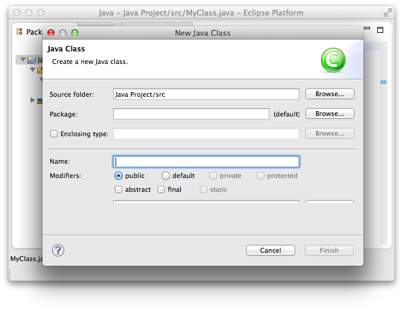
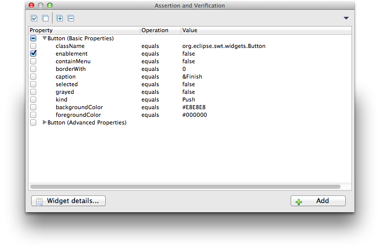
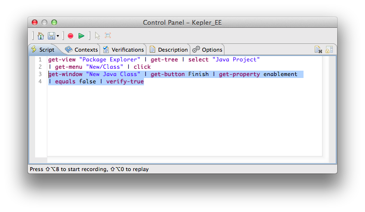
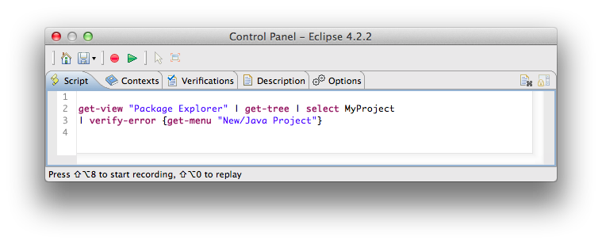

### Introduction

RCPTT supports two recording modes: the Recording mode and the Assertion mode. 
You can select any of them by clicking on the corresponding button of the 
the [Control Panel](../controlpanel/) toolbar. 
You can also use hotkeys to switch between them, which is useful for some cases when a mouse click affects the 
current state of any AUT elements. The hotkey hint is shown in the bottom 
of the [Control Panel](../controlpanel/) window.

In assertion mode you can verify any property of any widget (tree, button, text, canvas, etc.).

### How it works

During a test recording switch to assertion mode:


Use button to switch to assertion mode
You can also use hotkeys to switch to assertion mode

Select any AUT widget you want to assert (you will see red frames). 
Let's say we need to assert that Finish button is disabled in New Java Class Dialog:

Once you select a button the assertion window appears containing widget properties with their values.
Select the required one and press  Add button:

The assertion code is added to your test script immediately:

  
  ### Negative case. How to assert the absence of the elements?
  
  Sometimes we need to verify the absence of some UI element, like when we've deleted an item from a tree we 
  need to verify that there is no such an item anymore.
  
  We can do it with the help of  command.
  Let's say we need to verify that there is no **New/Java Project** menu when we are in a Plug-in Development Perspective.
  So we add a negative assertion manually:
  

   
  
  
