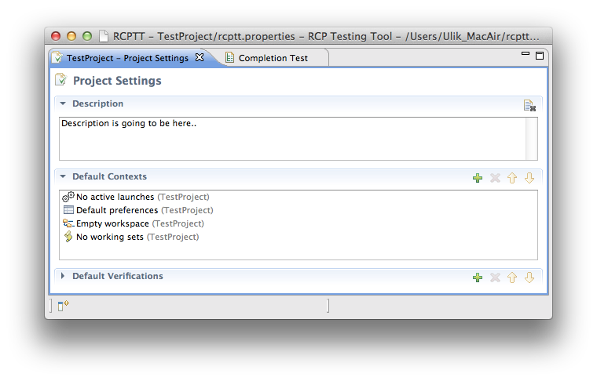
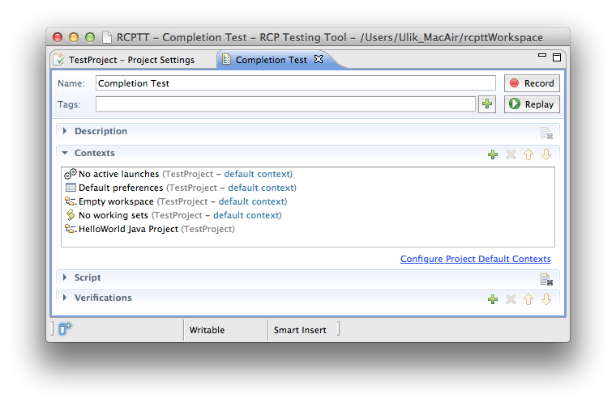
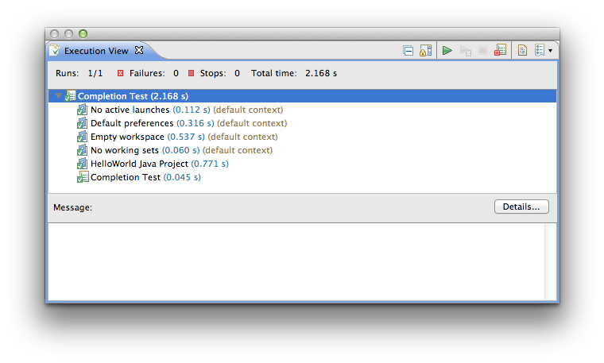

It's good practice to make test case to be focused on testing functionality itself and all operations for preparing 
application  should be moved out from test case to some place. In case of RCPTT the contexts is the right place for these 
purposes. RCPTT contexts are applied to application before test case execution. In eclipse there are several groups of 
standard mutable configurations/states: preferences, workspace, workbench.

In the process of using RCPTT to create test projects, we came to the conclusion that some contexts should be executed 
before each test cases. For example, when testing JDT before each test should be cleared Workspace and Working Set, 
and terminated all active launches. Initially for these purpose Group Context is used, this context should be added t
o each test case in RCPTT project. But this practice was uncomfortable, because at the addition of a new test case, it 
was necessary not to forget to add the Default Group Context. So we introduced the concept of the 
Default Contexts list.

At the creation new RCPTT Project the Project Settings file is created automatically. 

Description of project can be given in "Description" section of the 
Project Settings. 
Default Contexts can be set in "Default Contexts" section. Contexts to default contexts
 list can be added from this RCPTT project and also from related RCPTT projects.
 
 
  
  These default contexts are displayed in test cases. Sequence contexts defined in the Default Contexts 
   list can not be changed in the test case and custom contexts can be added to test case only after 
   default contexts. Project Settings can be opened 
   from test case by clicking on {{m.uiElement("", "#{site.url}/shared/img/ui-configure-project-default-contexts.png")}}
   link.
  
 
   
  At the replaying test case the default contexts are displayed in Execution View. 
  Custom contexts are executed after default contexts execution.
  
  
  
