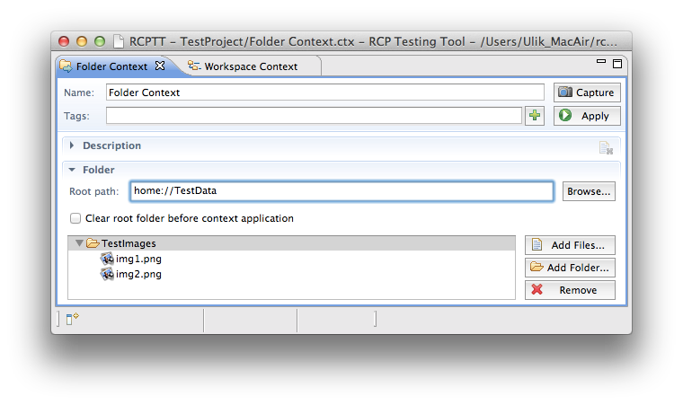
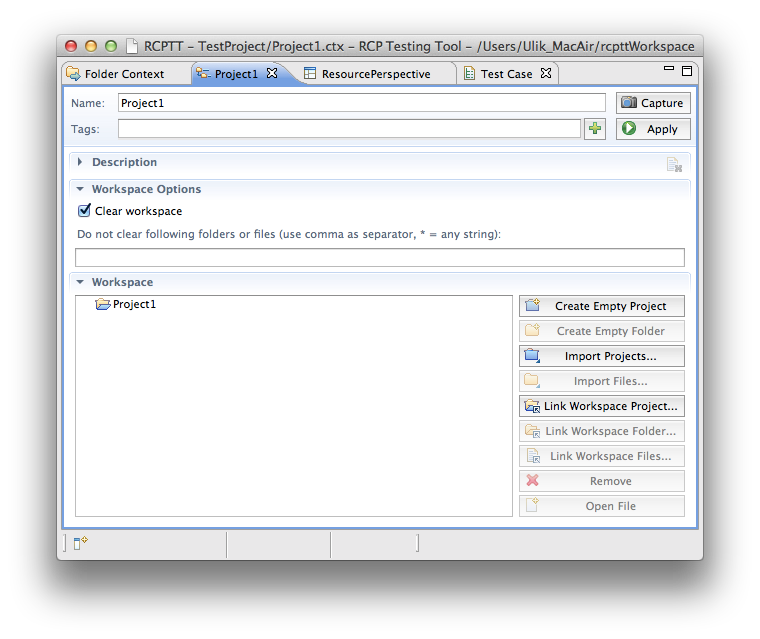
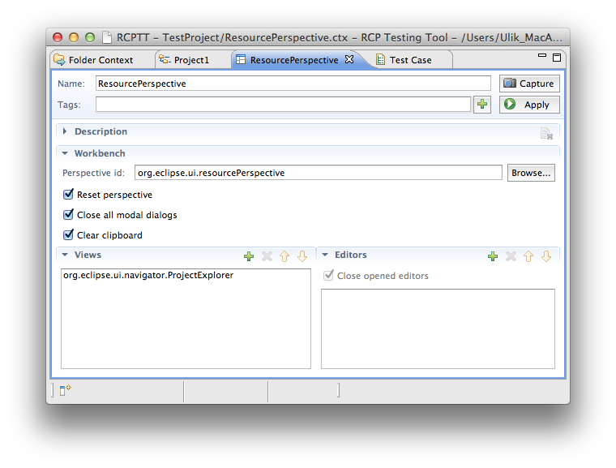
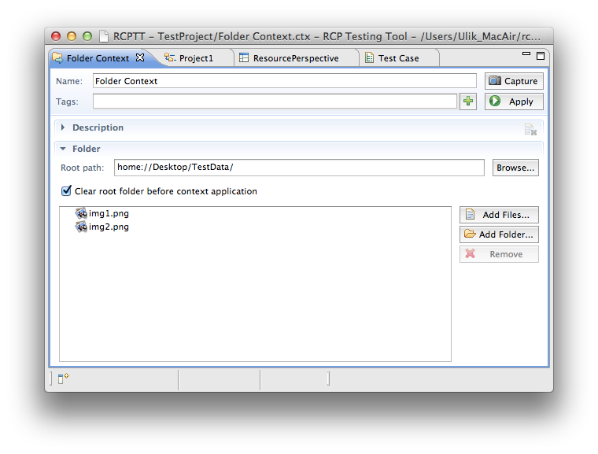
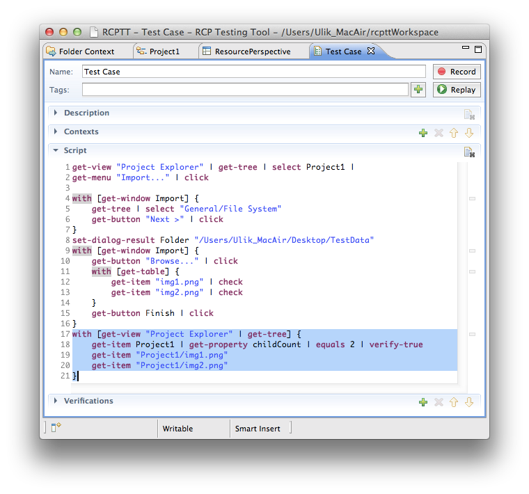

# Introduction

If you need to prepare your AUT workspace you use a [Workspace context](../workspace) [Workspace context](../workspace) which places files on a workspace before a 
test execution. But sometimes you may need to put data somewhere outside your AUT workspace - anywhere on your disc
 space. Folder Context was coined for this purpose. When applied it puts files into a selected root folder. 
 
 
 <!-- Name -->
 A searchable name to quickly identify and find the context among others 
 <!-- Tags -->
 Tags allow arbitrary grouping of contexts. Use Tags view to see the groups. 
 <!-- Add Tags -->
 Add tags interactively
 <!-- Capture -->
 Make a snapshot of resources from a root path and copy them into this context 
 <!-- Apply -->
 Copy files from context into root. If Clear root folder option is on, removes existing files from a root first. If the option is off, exising files are still replaced with matching ones from the context.
 <!-- Root path -->
 A destination for files. When a context is applied - its resources are copied into this location. If Clear root folder option is on, it is wiped beforehand.
 <!-- Browse... -->
 Show Open File dialog to select root path
 <!-- Clear root folder before context application -->
 Clean (delete everything from, wipe) root before the context is applied. Dangerous - a typo in the Root path may delete anything from filesystem irreversibly.
 Current content of the context. These files will owerwrite the data in the Root path when context is applied.
  <!-- Add Files... -->
 Import files into the context. Allows to exlpicitly manage the content when Capture is not suitable.
  <!-- Add Folder... -->
 Recursively import folder into a context. Allows to exlpicitly manage the content when Capture is not suitable.
  <!-- Remove -->
 Remove selected resource(s) from this context. The resources in root path are untouched, but wil no logner be updated on Apply
 

  Above is a Folder Context which puts *img1.jpg* and *img2.jpg* files  in a *TestData* folder on a *C* disc.  
  You can also add a folder with files:
  
 
  
  *TestImages* folder with 2 files will be added to a root location when the context above is applied.
  
  # Root Path
  
  Folder context can use a relative path to a current User Directory or to AUT workspace.
  
  Let's say you need to place img1 and img2 files into *C://CurrentUserDirectory/TestData/*. 
  When you select it as a root path you will see that RCPTT replaces it with *home://TestData/*
  
  

  
  Which means that a folder context will pass regardless of the Current User Directory name.

  Likewise, AUT workspace path is replaced with *workspace://* which makes Folder Context act almost 
  like a [Workspace context](../workspace):
  
  
  
  If there is no TestData folder  - it will be created.

  If there already is TestData folder - its content will be **merged** with a context 
  content (only if Clear root folder option is disabled).
  
  >  Even without Clear root folder option, some of existing content may be overwritten and lost during *merge* operation.
  
# Clear root folder option
Like in a [Workspace context](../workspace) there is an option - Clear root 
folder before context application (disabled when the context is created).

<!--  Clear root  -->
Turned off by default. Whether a root folder should be cleaned before the context is applied 

If enabled it leads to clearing a root folder before the context is applied.
  
  When the context above is applied all TestData content is deleted and then *TestImages* folder with *img1*, *img2* files are placed there.
  
  > ## Important
  >  Please be careful with root folder path - once you set something 
  >  like *home://* or *file://C:/* and enable Clear root folder option - all your 
  >  root content will be completely deleted once a context is applied. 
  >  Please make sure that your root path is followed by any other folder like *home://TestData*.
  
# Test example: File Import

Let's say you need to test that file import works correctly. 
To do this you're going to import two files from a *//Desktop/TestData* into your Project1 using a Resource Perspective.  

You need the following contexts for your test:
  
## Workspace context
[Workspace context](../workspace) - to clear your AUT workspace and put Project1 there:

## Workbench context
[Workbench context](../workspace) - to open a Resource Perspective with Project Explorer view:

## Folder context
Folder Context - to put files for import into a *home://Desktop/TestData folder* (or to create this folder if there's no any):

Next, create a test case and add these three contexts into it and start recording - the contexts will be applied to make everything ready for a file Import:

Do not forget to add an [assertion](../../assertions) to verify that the images were successfully imported into a Project1 (see the selected script).
   
   
