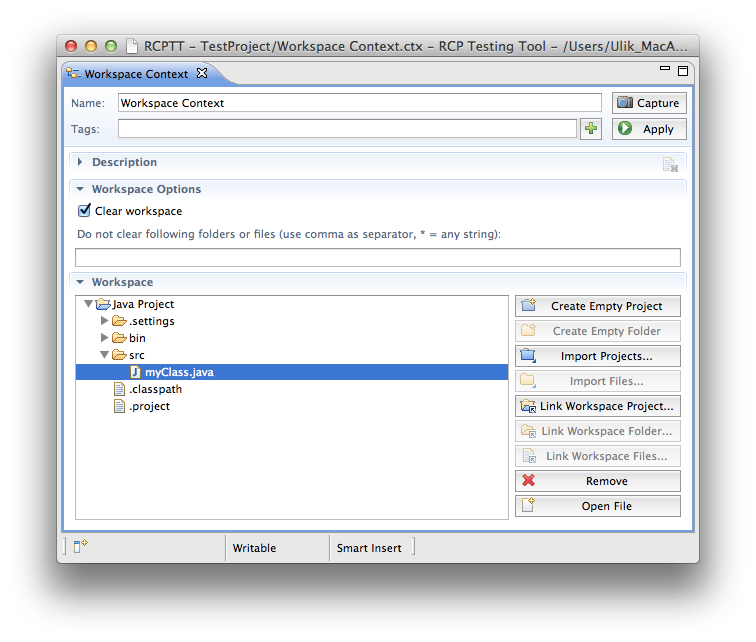
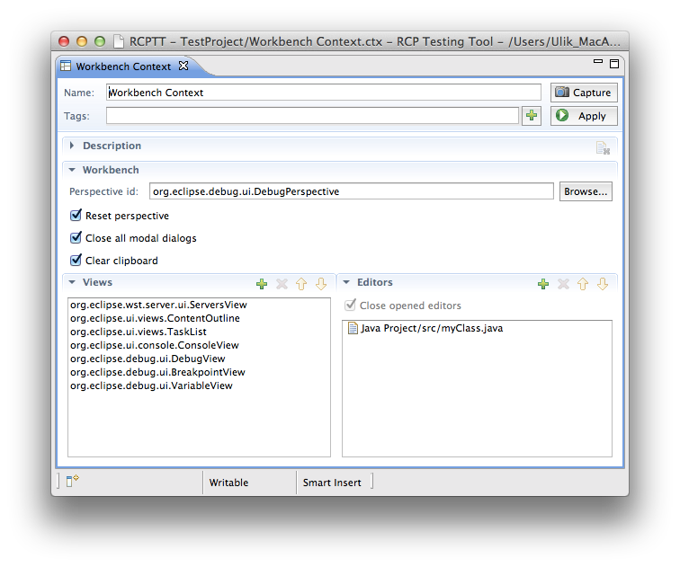
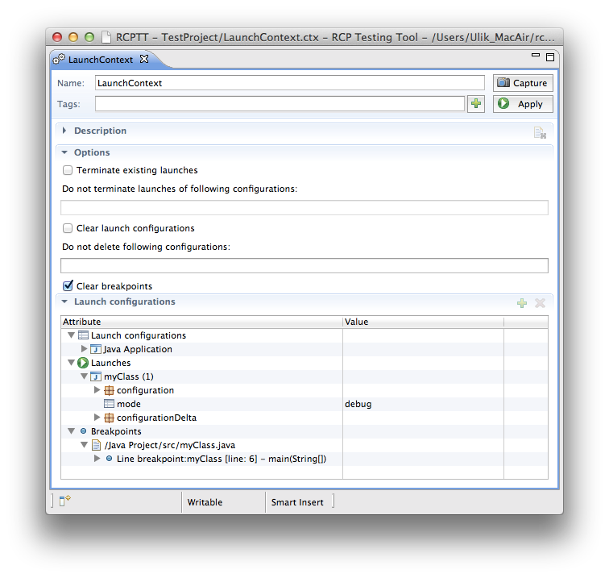
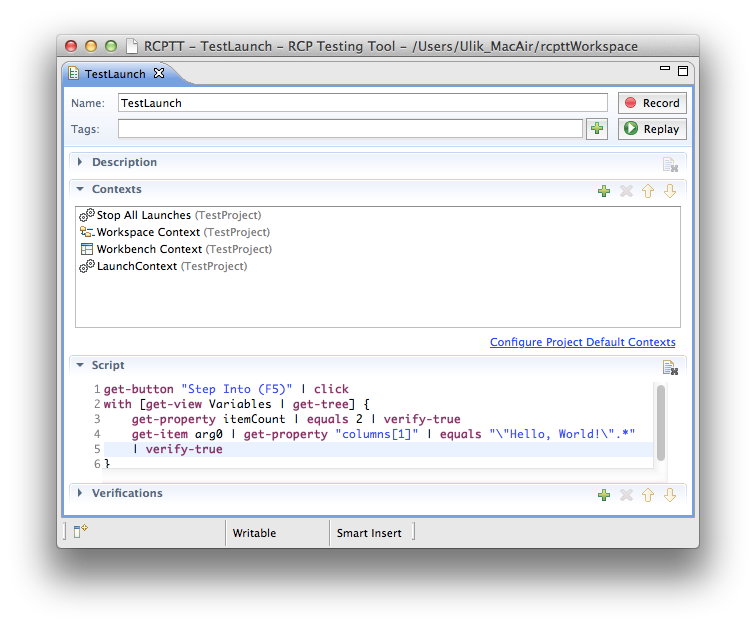

Launch contexts are used to control AUT Launches and Launch Configurations. 


<!-- Name -->
 A searchable name to identify and find the context among others
  
  <!-- Tags -->
 Tags allow arbitrary grouping of contexts. Use Tags view to see the groups.

  <!-- Add Tags -->
 Add tags interactively
  
  <!-- Capture button  -->
 Make a snapshot of AUT running launches and launch configurations and copy them into this context. 

  <!-- Apply button  -->
   
  Adds launch configuration to AUT. Launches given configuration in a defined mode. Suspend launch at a given breakpoint.  If Clear workspace option is on, removes existing projects from AUT at first.
  
  
  <!-- Terminate existing launches -->
 Turned on by default. Terminates all running launches if any. 
  
  <!-- Keep launches -->
  
  A comma separated list of launches exempt from Terminate existing launches
  
  
  <!-- Clear launch configurations -->
   Turned off by default. Clears a list of AUT launch configurations. 
  
  <!-- Keep configurations -->
  
  A comma separated list of configurations exempt from Clear launch configurations
  
  
  <!-- Clear breakpoints -->
   Turned on by default.  Clears all breakpoints. 
  
  <!-- Add button -->
   "Add" button is always disabled for now.
  
  <!-- Remove button -->
   Remove launch configuration/launch with this button. 

  
#  Introduction 

Launch Context can:

- Add Launch Configurations and/or run the required ones
- Add breakpoints and pause a required launch at a breakpoint
- Terminate existing launches
- Clear launch configurations
- Clear breakpoints

Thus you may flexibly adjust your AUT's Launch Configuration state before the test that launches something.

## Terminate Existing Launches.

Once you create a new Launch Context you can see that Terminate existing launches option
is enabled by default. When the context is executed all running launches in your AUT
will be terminated. 

You can exclude any desired launches to avoid their termination - just list them
in a Do not terminate launches... field:


<!-- Keep launches -->
 When the context is executed all launches are terminated except "myClass".


If Terminate existing launches is unchecked no running launches will be
terminated by this context.

### Clear Launch Configurations

This option should be used if you wish to clear a list of existing Launch Configurations (disabled
by default).

By analogy with the termination described above you may want to leave some Run Configurations.
Just list them in Do not delete following configrations.

### Capture running launches state into a Launch Context.

Let's say you have 2 Launch Configurations -  HelloWorld and ByeWorld -  and to do your test
you need both of them running and suspending at breakpoints.

Once you have this state in your AUT you can press  Capture button and all your AUT launches
state will be captured as a context which will have all information about:

- Existing launch configurations
- Exising running launches (and their running modes - "run" or "debug")
- Existing breakpoins

Now you can use this context in your test case - it will add corresponding configurations, run the
required launches in a debug mode and suspend them at their breakpoints.

Once you captured launch configurations - you can always edit the context manually by removing any of
the configurations with  Remove button ( Add function is not available in this context).
  
You may also manually change the attribute values:


<!-- Keep launches -->
   You can change the mode, set 'run' or 'debug'. 

  
### Test Example: verify variable value during a debug process.

Let's imagine that you need to create a test case which verifies that variables are correctly updated
during a debug process.

To get this you need to create your Java class file, set a breakpoint, run this class in a debug
mode, switch to debug perspective with variables view and (finally!) make a verification.

But in fact all actions before a verification - is AUT state and not the test itself.  Using RCPTT Contexts
you may make your test elegant and easy-maintaining.

So you need the following contexts:
- [Workspace context](../workspace) - to put Java Project on AUT workspace:
  
- [Workbench context](../workbench) - to switch to Debug Perspective:
  
- Launch context - to set a breakpoint and run java class in a debug mode:
  

Place these contexts into your test case and record your test which shrinks to a few lines of code:

Note a *Stop all launches* context marked as a [Default context](../default).
It terminates all active launches before a workspace context will try to delete all files.
This prevents the situation when some files could be locked by previosly lauched programs. It's a good practice
to use this context as a [Default Context](../default) for any AUT with launches.
