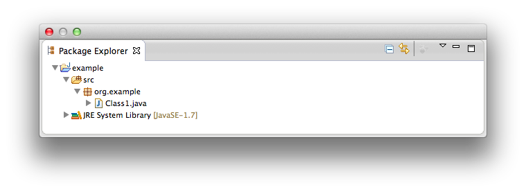
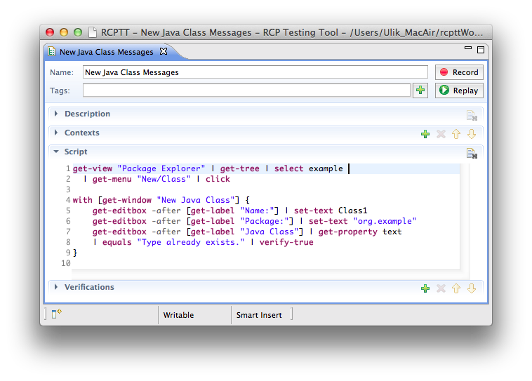
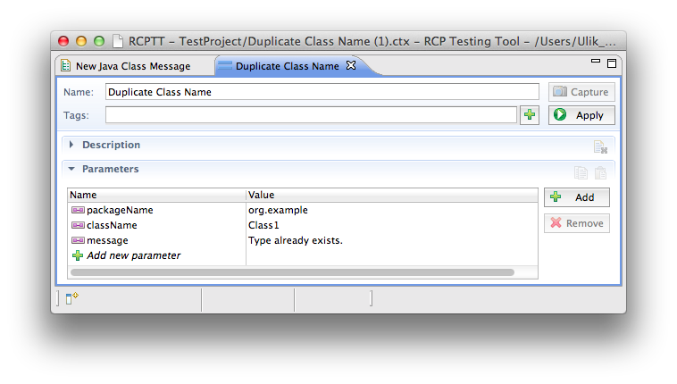
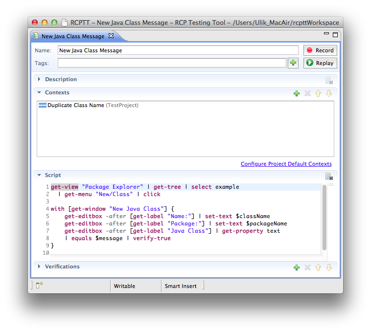


  
  <!-- Name -->
 Context name. This name is automatically synced with file system name. Symbols in name which are not allowed in file names are replaced with underscore character.

  <!-- Tags -->
 Comma-separated list of arbitrary hierarchical tags, i.e. <code>resourcePerspective, jira/PC-1352, windows-only</code>
  
  <!-- Add Tags -->
   Use this button to open tag selection dialog with list of tags from another test resources.

  <!-- Capture button  -->
  Unavailable for Parameters Context

  <!-- Add -->
   Add new parameter in a Parameters Context
  
  <!-- Remove -->
   Remove parameter(s) from a Context
  
  <!-- Parameters list -->
   A list of parameters with their values
  
  
  
### Introduction

One of the most asked features for RCPTT is to execute a same test with different parameters. 
This article demonstrates how Parameters Context and [Super Context](../super) achieve this. 
As an example, let's test error messages in *JDT New Class* Wizard. We start with a Java project with a single class:

First, let's record an initial script which launches a new class wizard, sets package and class name and asserts an error message:
  

Now, what we really want is to type various values into 
*Package* and *Name* fields and make sure that error message changes accordingly. 
As a next step, let's parameterize a script using Parameters Context:
  

  
Next, let's place a Parameters Context into a Test Case and use `$paramName` in a script:
  

  
Please learn more about more efficient way of script parametrization by using [Super Context](../super)
  
  
  
  
