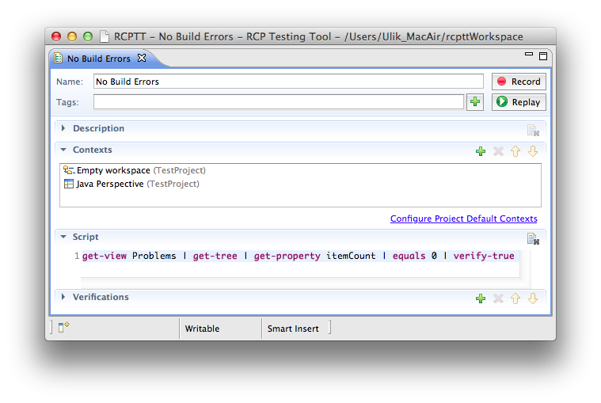
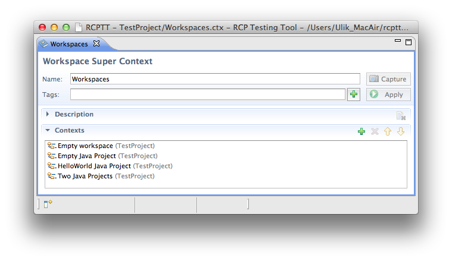
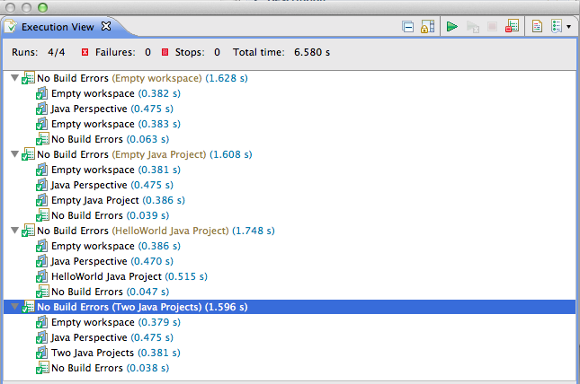
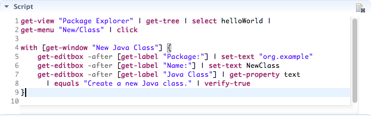
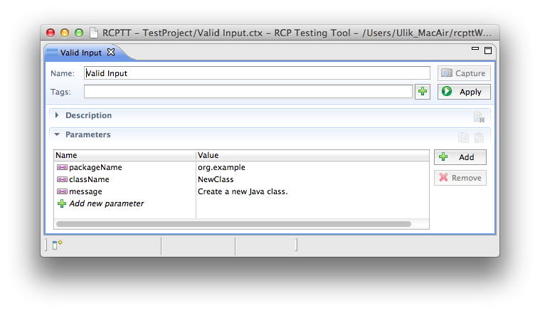
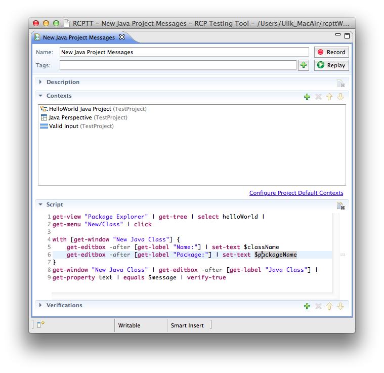
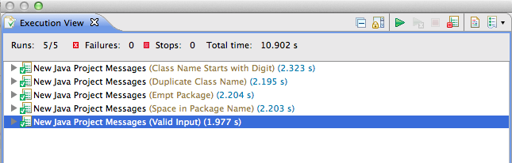

## Introduction
A test case in RCPTT consists of two parts:
- list of contexts, defining an application state
- ECL script describing UI actions and validating that application behavior in given state is correct.

In some cases it might be required to execute same actions with just a few variances in initial state or arguments 
of script commands. Common examples are:
- Test case verifies that a project can be built. An executed action is just a verification that Problems view is empty,
 but this should be done for several different projects. We can say that we have the same behavior for different states of workspace.
- Test case verifies that a form (like a new Java Class dialog) shows no errors. We execute basically the same actions 
(type values in fields and check error message), but with different command arguments.

Supercontexts cover both of scenarios above. A supercontext is a list of contexts of the same type, which can be refered in test cases just as usual contexts, but during an execution, a test case will be executed several times with each of these contexts.
  
## First example - building Java projects

We are going to create a test case which verifies that Problems view contains no errors for the following states of a workspace:
- empty workspace
- empty Java project
- "Hello, World!" Java project
- two referencing Java projects

We start with a creation of a usual test case which verifies that Problems view contains no errors.  

Next, we create three more workspace contexts:

- Empty Java Project
- HelloWorld java Project
- Two Java Projects

Then we create a new workspace supercontext (by selecting New -> Super Context) in a context menu in Test Explorer and add all 
our four workspace contexts into it: 

Now we can get back to originally created test case and replace Emtpy Workspace context with Workspaces supercontext.
 If we execute this test case, an Execution View shows it has been executed four times, each time with different workspace context:
 

## Second example - validating New Java Project dialog

For the next test case we are going to reuse Java Perspective workbench context and HelloWorld Java Project workspace context.

We record form filling in New Java project and validate an error message:

Now we need to parameterize it - first, create Parameters context "Valid Input" with parameters we are going to change:

Second, replace string values in script with **$paramName** and adding parameters context to a test case:

Third, create parameters context variations for each set of input values, put them into parameters supercontext and put this supercontext into testcase.

Once test case is executed, we can see that all inputs were iterated:

### More about supercontexts

If a test case refers to more that one supercontext, then all possible combinations of tuples from these supercontexts 
will be used. For instance, for our example above if we would like to check that all these Java projects can be built both 
with Java 1.6 and Java 1.5 compiler settings, we could create Preferences supercontext with two contexts **1.6** and **1.5**, add 
it to a test case, so that it will be executed 8 times and Execution View would show a list like this:

- No Build Errors (Empty Workspace, 1.5)
- No Build Errors (Empty Workspace, 1.6)
- No Build Errors (Empty Java Project, 1.5)
- No Build Errors (Empty Java Project, 1.6)
- No Build Errors (HelloWorld Java Project, 1.5)
- No Build Errors (HelloWorld Java Project, 1.6)
- No Build Errors (Two Java Projects, 1.5)
- No Build Errors (Two Java Projects, 1.6)

 In case we need to iterate over context pairs without this 'cartesian product' 
 (like, workspace context and parameters context specific for this workspace), this can be done by 
 creating a single group supercontext, referencing to several group contexts. For instance, if we create a test case 
 which validates a build error count, then we can have a structure like this:

- build errors (group supercontext)
  - one build error (group context)
    - workspace1 (workspace context)
    - params1 (params context)
  - two build errors (group context)
    -workspace2 (workspace context)
    - params2 (params context)

## Conclusion
Supercontexts are powerful but might be hard for inexperienced users. In case when there are only a few variances of a test case which are 
unlikely to be changed, it might be much more easier and faster to create few separate test cases instead of dealing with parameterization.
