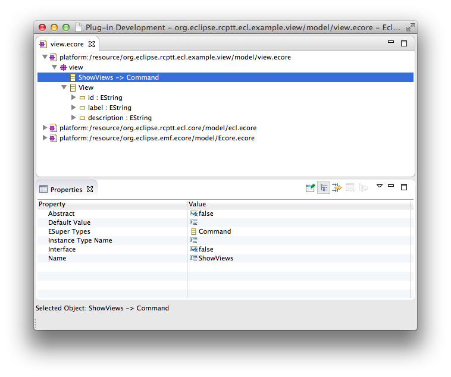

### Create Ecore Model

<ul>
- Create **model** folder in the root directory of your plugin</li>
- Right click on model folder and select **New > Other... > Eclipse Modeling Framework > Ecore Model > Next**</li>
- Choose a name for your model. In our case it will be **view.ecore**</li>
- Press Finish</li>
</ul>

Created model will be opened in the editor and we need to specify package details using Properties View as shown below:

### Add ShowViews command class

We need to create new EClass for our ECL command.
<ul>
- Create new EClass and change its name to **ShowViews** in the Properties View</li>
- Right click your editor and select Load Resource... menu item</li>
- In the opened dialog press Browse Workspace... button</li>
- Select **org.eclipse.rcptt.ecl.core/model/ecl.ecore** package:</li>
</ul>
 

<ul>
- Add **Command** from the ECL package as a super type to your ShowViews class.</li>
</ul>

### Add View class

Now we need one more EClass to represent Eclipse View details.
<ul>
- Create EClass called **View**</li>
- Add three string attributes to this class: **id**, **label</b> and <b>description**</li>
</ul>

### Generate java sources

We need to create generation model to build java sources for our model.
<ul>
- Right click on the **view.ecore</b> file in the <b>Package Explorer</b> and select <b>New > Other... > Eclipse Modeling Framework > EMF Generator Model > Next**</li>
- Default **view.genmodel** name for generator model is OK for us, so just press Next</li>
- Select Ecore model item and press Next</li>
- Click Load button and press Next again</li>
- Select view.ecore as a root package and add ECL and EMF packages as references. Press Finish</li>
</ul>

<ul>
- In the opened editor select View package and change base package attribute to **org.eclipse.rcptt.ecl.example**:</li>
</ul>

<ul>
- Right click View package and select Generate Model Core. All necessary java sources will be generated.</li>
</ul>

    <h3 class="panel-title">Important</h3>
  

  

    Please note, that you should set the same runtime version for **view.genmodel</b> as you have for <b>ecl.genmodel</b> in <b>org.eclipse.rcptt.ecl.core**.
 

