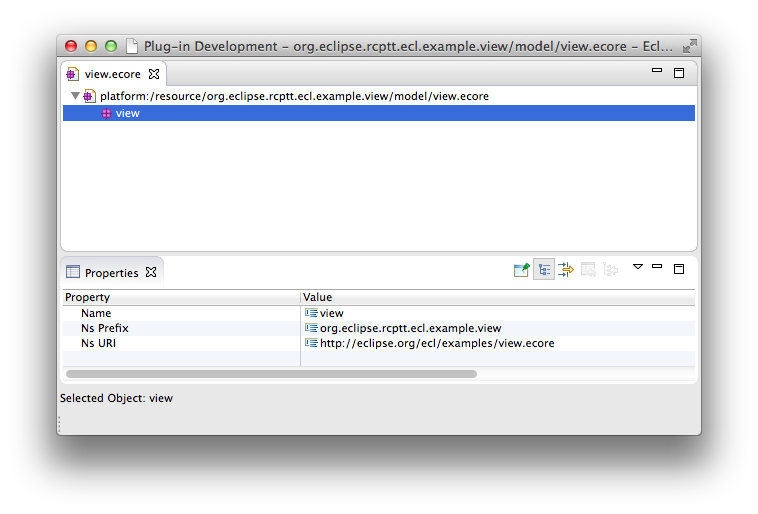
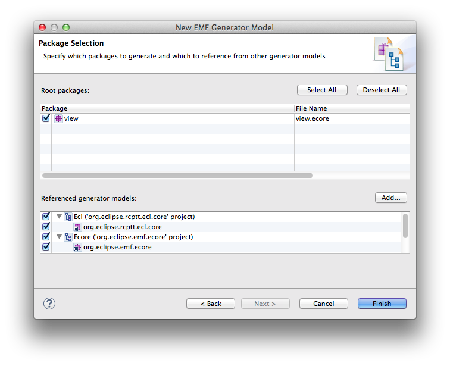
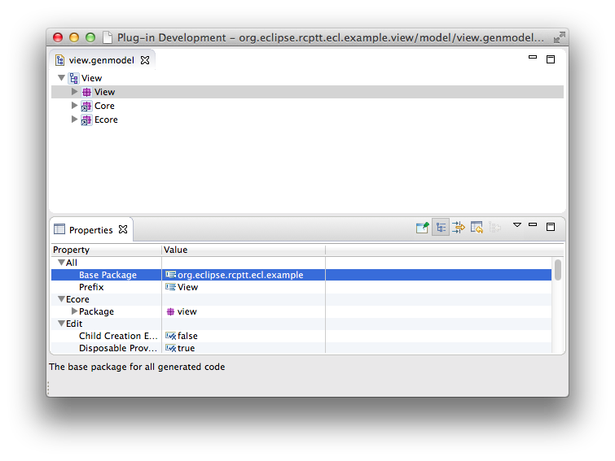

## Create Ecore Model
- Create **model** folder in the root directory of your plugin
- Right click on model folder and select **New > Other... > Eclipse Modeling Framework > Ecore Model > Next**
- Choose a name for your model. In our case it will be **view.ecore**
- Press Finish

Created model will be opened in the editor and we need to specify package details using Properties View as shown below:

### Add ShowViews command class

We need to create new EClass for our ECL command.
- Create new EClass and change its name to **ShowViews** in the Properties View
- Right click your editor and select Load Resource... menu item
- In the opened dialog press Browse Workspace... button
- Select **org.eclipse.rcptt.ecl.core/model/ecl.ecore** package:

- Add **Command** from the ECL package as a super type to your ShowViews class.

### Add View class

Now we need one more EClass to represent Eclipse View details.
- Create EClass called **View**
- Add three string attributes to this class: **id**, **label** and **description**

### Generate java sources

We need to create generation model to build java sources for our model.
- Right click on the **view.ecore** file in the **Package Explorer** and select **New > Other... > Eclipse Modeling Framework > EMF Generator Model > Next**
- Default **view.genmodel** name for generator model is OK for us, so just press Next
- Select Ecore model item and press Next
- Click Load button and press Next again
- Select view.ecore as a root package and add ECL and EMF packages as references. Press Finish

- In the opened editor select View package and change base package attribute to **org.eclipse.rcptt.ecl.example**:

- Right click View package and select Generate Model Core. All necessary java sources will be generated.

>Please note, that you should set the same runtime version for **view.genmodel** as you have for **ecl.genmodel** in **org.eclipse.rcptt.ecl.core**.
