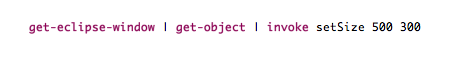
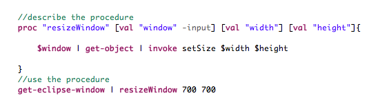
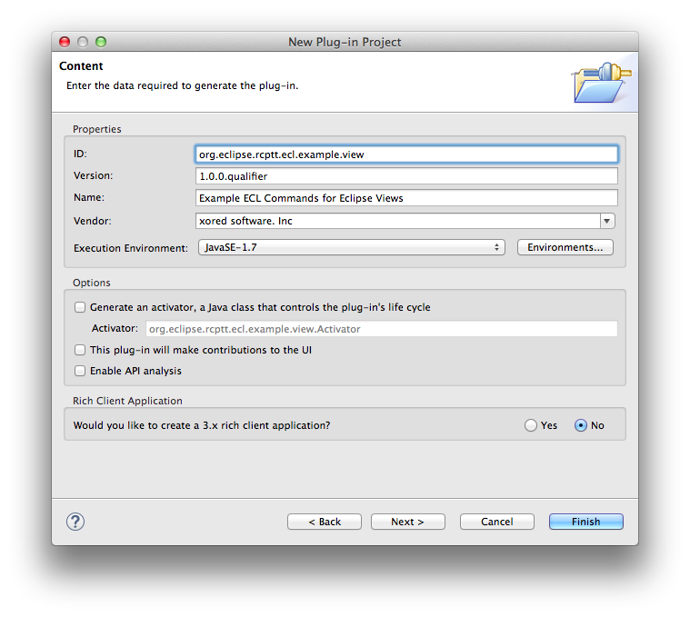
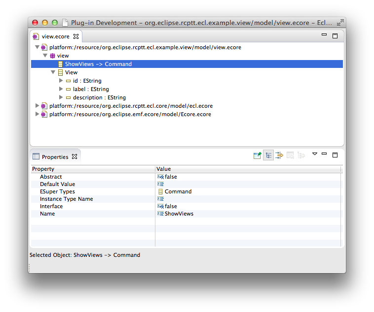
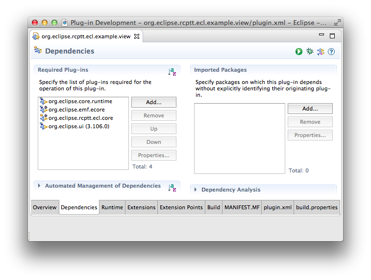
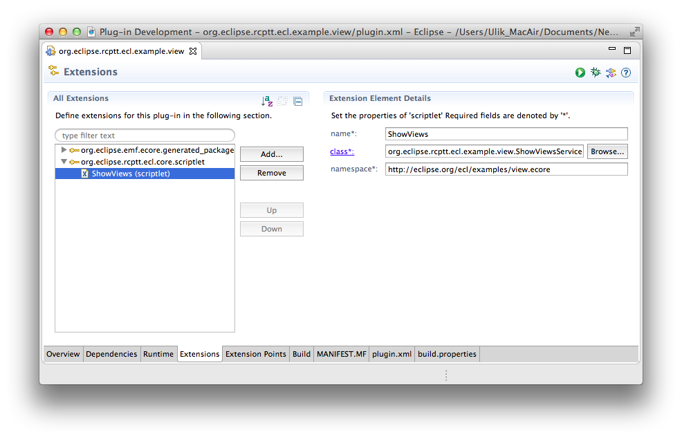
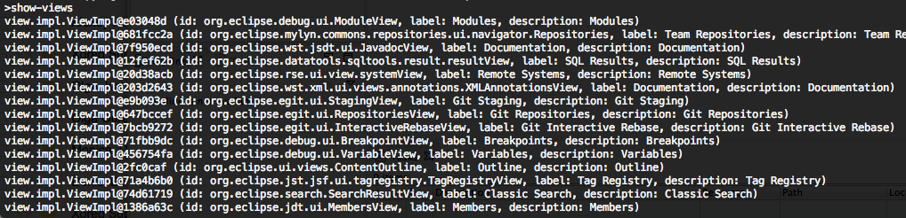
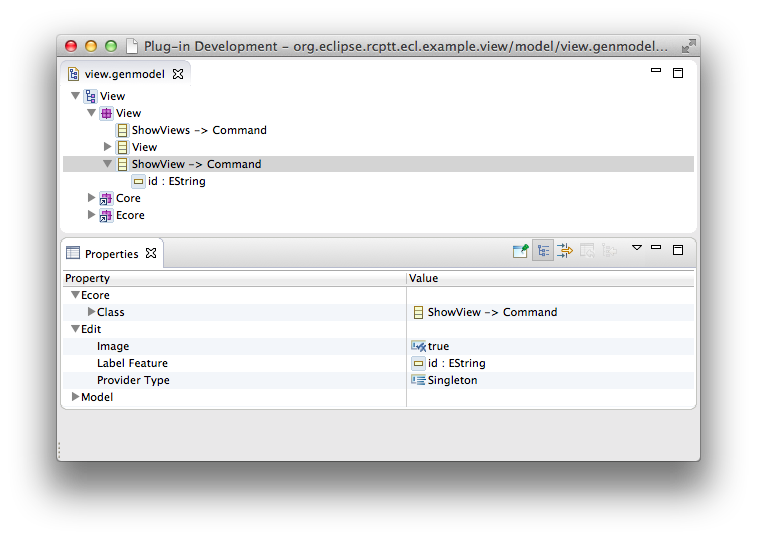
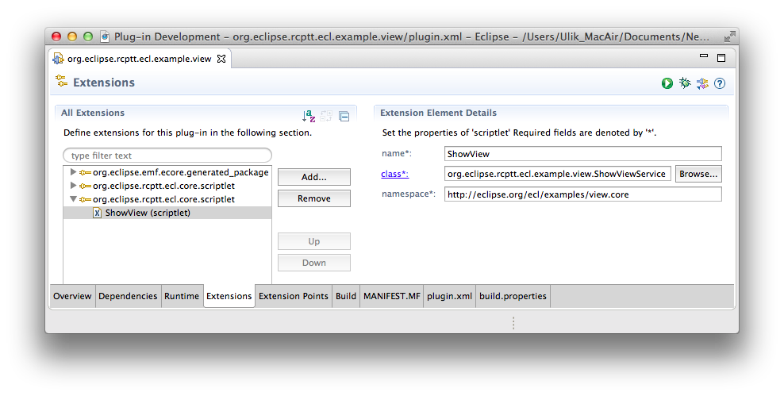
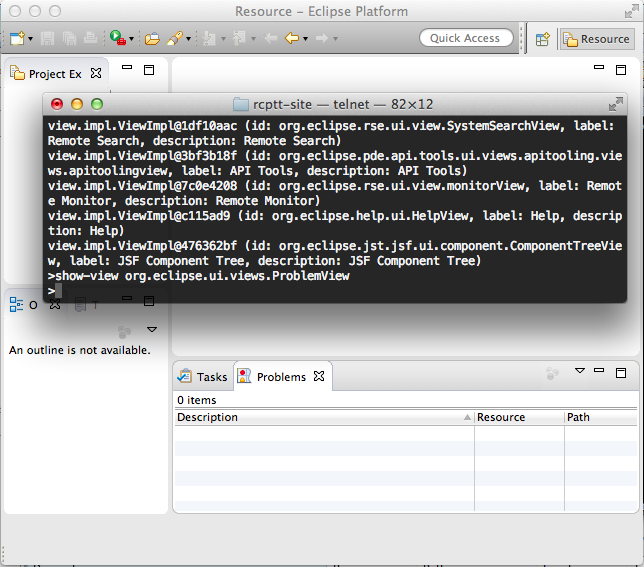

In this guide we show different ways of extending an existing ECL commands functionality, such as:
- Retrieve an existing method of Java Object with `get-object | invoke` commands
- Create static methods and use it with   command
- Create your own custom ECL command

## Use  command to call an existing method of Java object.

Let's say we need to resize a window to a given width and height. There is no such a command in ECL script, 
but we know that there is a corresponding `setSize(int width, int height)` Java method for Window Object. 

So using  and  ECL commands we can call this method:


You can define [ECL procedure](../../procedures), to make it more convenient:


## Create your own custom ECL command
We are going to show how to create custom ECL commands. As an example we create two ECL commands for Eclipse Views. 
First one will show us all registered views in our Eclipse. And the second one will open specified view by ID.

### Import RCPTT sources plugins
First of all you need to import RCPTT sources plugins from [RCPTT Git repository](https://github.com/eclipse-rcptt/org.eclipse.rcptt.git)

### Create Plug-in Project
First of all we'll create new plugin project for our ECL commands called **org.eclipse.rcptt.ecl.example.view**. You can use any existing plug-in as well.


### Define EMF model for ECL command
We need to create two EMF classes to show registered plugins with ECL:

- **ShowViews** which will be used as an ECL command. This EClass should extend **Command** EClass from the **org.eclipse.rcptt.ecl.core/model/ecl.ecore** package
- **View** which will be used to store view details. It should contains three string properties: id, label and description.



If you're not experienced EMF user you can find detailed instruction on the [Define EMF model for ShowViews command](../define-emf-model/) page.

### Implement ShowViews command

Now we need to implement ECL command. Make sure you have all necessary dependencies:



#### Implement ICommandService interface

Add new class **ShowViewsService** which implements **org.eclipse.rcptt.ecl.runtime.ICommandService** interface as shown below:

```java
public class ShowViewsService implements ICommandService {
 
    @Override
    public IStatus service(Command command, IProcess context) throws InterruptedException, CoreException {
        final IWorkbench workbench = PlatformUI.getWorkbench();
        final List<View> views = new ArrayList<View>();
        workbench.getDisplay().syncExec(new Runnable() {
            @Override
            public void run() {
                for (IViewDescriptor descriptor : workbench.getViewRegistry().getViews()) {
                    View view = ViewFactory.eINSTANCE.createView();
                    view.setId(descriptor.getId());
                    view.setLabel(descriptor.getLabel());
                    view.setDescription(descriptor.getLabel());
                    views.add(view);
                }
            }
        });
        IPipe output = context.getOutput();
        for (View view : views) {
            output.write(view);
        }
        return Status.OK_STATUS;
    }
 
}
```

As you can see the implementation is very simple. We use platform **IViewRegistry** to collect details of Eclise Views and store this information using EMF View objects. 
Then we write collected information to the output pipe. Note that view service will be executed using Eclipse Jobs, so we use Workbench Display to access view info in the UI thread.

#### Register ECL command implementation

Finally we need to register our service using **org.eclipse.rcptt.ecl.core.scriptlet** extension point:



- **name** - name of the EClass which we use for ECL command
- **namespace** - EMF Package URI
- **class** - command implementation class. Should implement **ICommandService** interface


By default name of the command EClass will be transformed to the ECL command name. For example, in our case commands will be named show-views.
 However you can override this name using **friendly_name** part of the **org.eclipse.rcptt.ecl.core.scriptlet** extension point.
 
 ### Use show-views command
 
- Let's start new Eclipse instance with the following plugins installed:
    - **org.eclipse.rcptt.ecl.example.view**
    - **org.eclipse.rcptt.ecl.core**
    - **org.eclipse.rcptt.ecl.parser**
    - **org.eclipse.rcptt.ecl.shell**
    - **org.eclipse.rcptt.ecl.telnet.server**
    - **org.eclipse.rcptt.ecl.telnet.server.ui**
    - **org.eclipse.rcptt.tesla.jface.fragment**
    - **org.eclipse.rcptt.tesla.swt.fragment**
- Connect to the ECL telnet server started in this Eclipse (on the 2323 port by default) using any telnet client
- Enter show-views command
- As a result of your command you will see something like this:
  

### Add show-view command
In the previous sections we discussed how to collect information from Eclipse using ECL. 
Now let's add another command which will open some view by id.

#### Add ShowView EClass

Create one more EClass called **ShowView** with one string field **id**. This is ECL command and should extend **Command** EClass.


#### Implement ShowView command
Add **ShowViewService** Java class:

```java
public class ShowViewService implements ICommandService {
 
    @Override
    public IStatus service(Command command, IProcess context) throws InterruptedException, CoreException {
        ShowView view = (ShowView) command;
        final String id = view.getId();
        PlatformUI.getWorkbench().getDisplay().syncExec(new Runnable() {
 
            @Override
            public void run() {
                try {
                    PlatformUI.getWorkbench().getActiveWorkbenchWindow().getActivePage().showView(id);
                } catch (PartInitException e) {
                    throw new RuntimeException(e.getMessage(), e);
                }
            }
        });
        return Status.OK_STATUS;
    }
 
}
```

We added this service specially for ShowView command, so we can freely cast specified command to ShowView interface. 
This allows us to get id of the view we need to open. Next we use Eclipse Platform API to open view by id in the UI thread.

#### Register ShowView command
Finally we need to register new command through **org.eclipse.rcptt.ecl.core.scriptlet** extension point:



#### Use show-view command

Now we can run our plugin and open necessary view by id:



By the way, you can use **show-views** command to find id of a view you want to open.

> Please note that to make your new custom command work you need to include a plugin with your custom command into your AUT configuration. 
