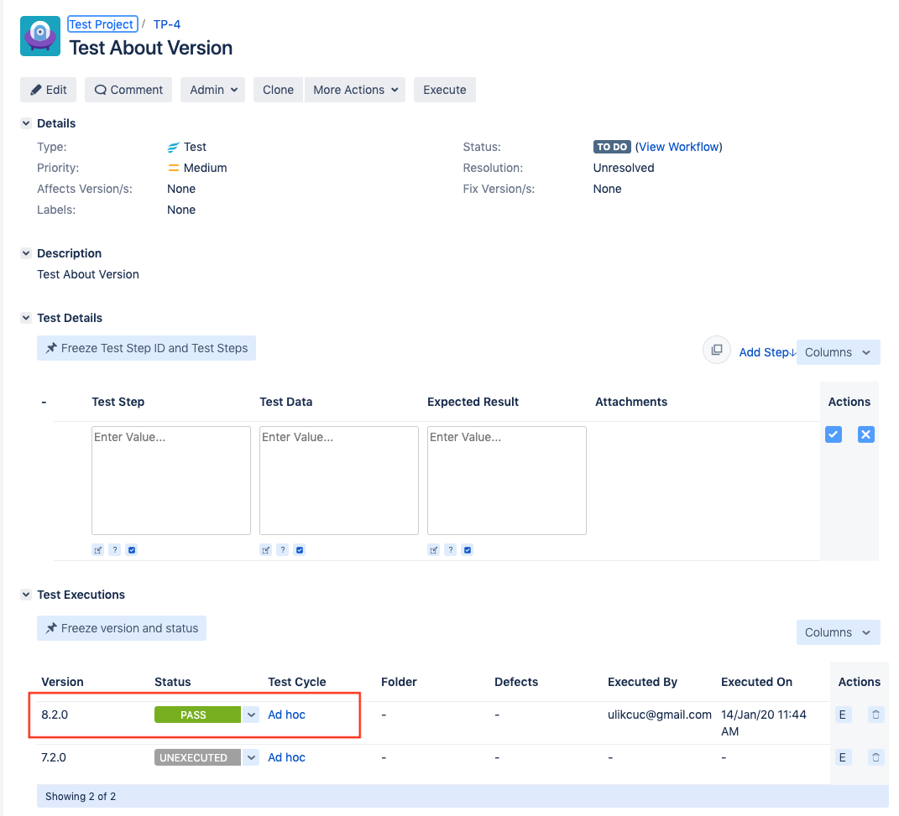

To configure connection to Zephyr, you need to know the following parameters:

- **baseUrl** — Zephyr Host. Should be valid URL.
- **username** — Username.
- **password** — Password.
- **project** — Project.
- **version** — Product version.
- **cycle** — Test cycle.
- **issue** — Jira issue number.


### Configure RCPTT IDE
To configure connection in RCPTT IDE, go to Window -> Preferences -> RCP Testing Tool -> Integrations -> Zephyr, activate 'Enable integration with Zephyr' checkbox and provide all parameters.
You can test connection by using 'Test connection' button.


Note that the password is stored in the Secure Storage, so you will be asked to type your master password.

If you want to send Test Run results to Zephyr for specific Test Suite, you should enable 'Zephyr' engine in Run Configuration. To enable the engine, go to Run -> Run Configurations..., choose the Test Suite and activate 'Zephyr' checkbox on 'Test Engines' tab. By default, 'Zephyr' engine is disabled and Test Suite and Test Run results are not sent to Zephyr.


### Using Zephyr features in RCPTT Test Case

#### Provide Zephyr Issue
To bind RCPTT Test Case with Zephyr Issue, add a new Test Case property called 'zephyr-issue' and provide issue number from Jira.


#### Specify test project name, test version and test cycle

Open Project properties -> Zephyr


Execute the test case. Now you should see execution result in JIRA:



### Configure RCPTT Maven Plugin

To configure connection in RCPTT Test Runner, add 'testEngines/testEngine' to the configuration section in your pom.xml.
For Zephyr engine specify 'zephyr' ID value and list of parameters.

Example:

```
<configuration>
  ...
  <testEngines>
    ...
    <testEngine>
      <id>zephyr</id>
      <parameters>
        <baseUrl>https://zephyrexample.com/</host>
        <username>sephyr_username</username>
        <password>1234567890</password>
      </parameters>
    </testEngine>
  </testEngines>
</configuration>
```

Please set project, version and cycle in .project file.