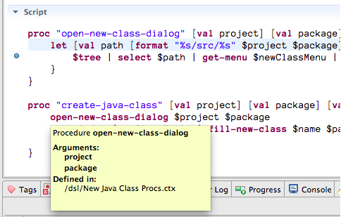

### Introduction


While automated recording in RCPTT works well, a lot of advanced users prefer to write ECL scripts manually, 
as it allows to create more flexible and maintainable test cases. So we have significantly 
improved the expressive power of ECL by introducing user-defined variables (via let blocks) and user-defined procedures
(via proc commands). Before going into details, here's a simple example - suppose we are testing Java editor and would 
like to hover a ruler on a currently selected line. Here's how it can be done without using variables in a plain old ECL:

```ecl
get-editor "Program.java" | get-left-ruler |
    get-ruler-column AnnotationColumn | hover-ruler
        [get-editor "Program.java"] | get-text-viewer |
         get-property "caretPosition.line" -raw]
```


This is not so much easy to write, and, what is more impotant, not so easy to understand. 
  Now take a look how the same actions can be expressed using variables:
```ecl
with [get-editor "Program.java"] {
    let [val currentLine
           [get-text-viewer | get-property "caretPosition.line" -raw]]
        [val rulerColumn
           [get-left-ruler | get-ruler-column AnnotationColumn]] {
        $rulerColumn | hover-ruler $currentLine
    }
}
```

And if we need to do this operation multiple times in different scripts, we can rewrite it to a procedure:

```ecl
proc "hover-current-line" [val editor -input]
    [val columnName "AnnotationColumn"] {
  with $editor {
    let [val currentLine
           [get-text-viewer | get-property "caretPosition.line" -raw]]
	[val rulerColumn
           [get-left-ruler | get-ruler-column $columnName]] {
        $rulerColumn | hover-ruler $currentLine
    }
  }
}

// Hover Annotation column:
get-editor "Program.java" | hover-current-line

// Hover Projection column:
get-editor "Program.java" | hover-current-line ProjectionRulerColumn
```

### Let

Variables are immutable and once set, their value cannot be changed, so probably it it more correct to name them as 'named values', 
but we are going to use a term 'variable' as it more familiar and recognizable. 'let' command allows to declare an arbitrary number 
of variables and then execute a script referring these variables. Variables are visible only in a script, passed to a 'let' command. Here's a
simple example of a 'let' block, which declares a variable 'foo' and shows a message box with its value:

```ecl
let [val foo "Hello, world!"] {
    show-alert $foo
}
```

We can put as many 'val' declarations as required, and specify a result of another command as a value.
  So, in a script below we store a result of 'get-window' invocation in a variable 'window':

```ecl
let [val button OK] [val window [get-window "New project"]] {
  $window | get-button $button | click
}
```

Also, it is possible to take a value of a variable from an input pipe by specifying '-input' 
  argument after variable name. In this case, the value of a variable will be taken from an input pipe of a 'let' command:

```ecl
emit "Hello, wrold!" | let [val msg -input] { show-alert $msg }
```


This might be particularly useful in a combination with 'foreach' command:

```ecl
with [get-view "Package Explorer" | get-tree] {
  collapse-all
  get-items | foreach {
    let [val item -input] {
      format "project %s" [$item | get-property "caption" -raw] | log
    }
  }
}
```


Let blocks also can be nested:

```ecl
let [val foo "Hello"] {
    let [val bar "world"] {
        show-alert [format "%s, %s!" $foo $bar]
    }
}
```


### Proc

Similar to TCL language, a command  can be used to declare a user-defined procedure. 
It takes a procedure name, parameters and body as arguments. Once 'proc' command is executed, a new command 
with a procedure name becomes available and can be executed as any built-in ECL command. Because of current ECL syntax restriction, 
if a procedure name contains a '-' character, its value should be enclosed into double quotes during declaration. 
  However, to invoke a procedure, double quotes are not required (and even prohibited). Here's an example of a procedure without arguments:

```ecl
// declaring procedure:
proc "hello-world" {
    show-alert "Hello, world!"
}

// invoking procedure:
hello-world
```

Procedures can have any number of arguments:
```ecl
// Declaration:
proc "close-window" [val title] [val button] {
    get-window $title | get-button $button | click
}

// Invocation:
close-window "New Project" "OK" // ordered args
close-window -button "OK" -title "New Project" // named args
```


Procedures can define 'input' arguments and default values for arguments:

```ecl
// Declaring
proc "set-text-after-label" [val parent -input] [val label] [val text ""] {
    $parent | get-editbox -after [get-label $label] | set-text $text
}

// Using &ndash; text arg is not set, so default value will be used
get-window "New Project" | set-text-after-label "Project name:"
```

### ECL and RCPTT



All changes described above are available in core ECL and available when ECL is used without RCPTT, 
however, when it comes to RCPTT, it becomes even more powerful:

- Procedures can be declared in ECL contexts, and in this case they will be available to all test cases, referring to declaring context
- Values declared in Parameter contexts can be accessed in the same way as variables, using $-syntax
- ECL and parameter contexts can be added to [default contexts](../contexts/default/), and therefore, automatically become available in all test cases in given project
- Test case and ECL editors support completion, navigation and documentation for procedures, variables in 'let' blocks and parameter names from [parameters contexts](../contexts/parameters/)

A sample project, illustrating the expressive power of procedures is available on GitHub - https://github.com/xored/q7.examples.procs. 
  You can run a test case from this project on your machine by executing the following commands in shell:

```bash
$ git clone https://github.com/xored/q7.examples.procs.git<br>
$ cd q7.examples.procs<br>
$ mvn clean package<br>
```
