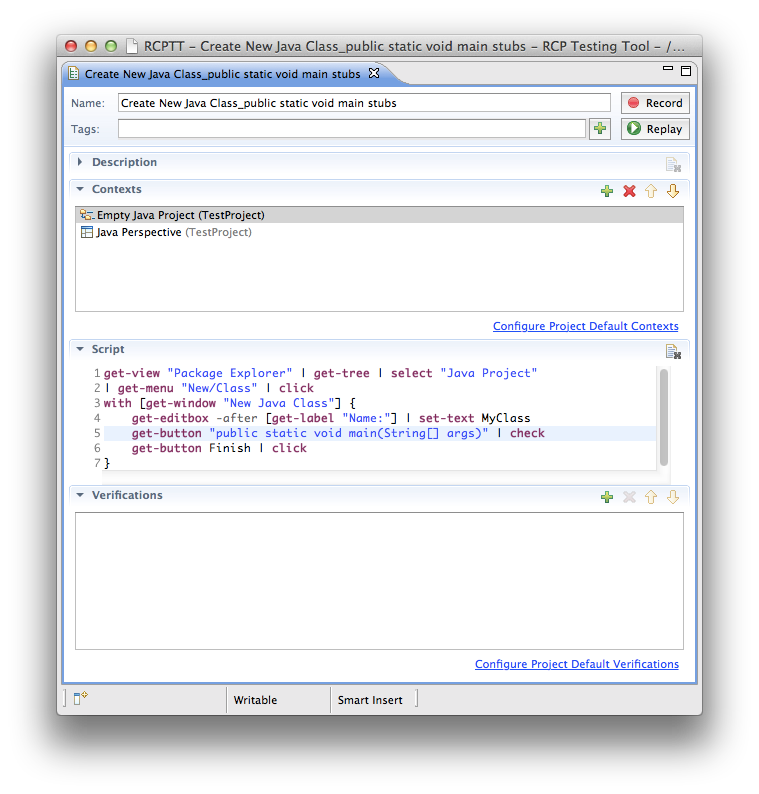
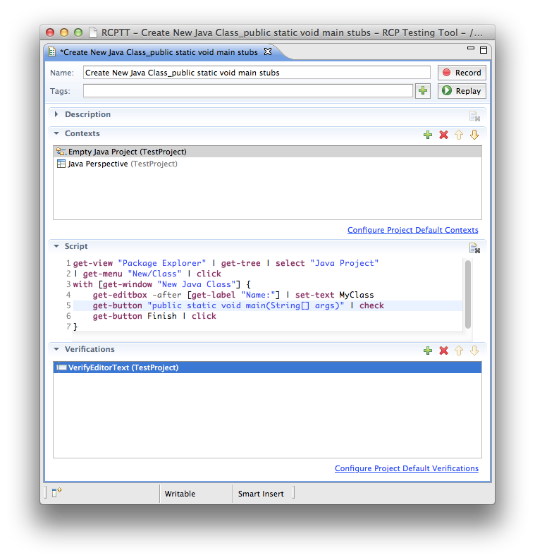
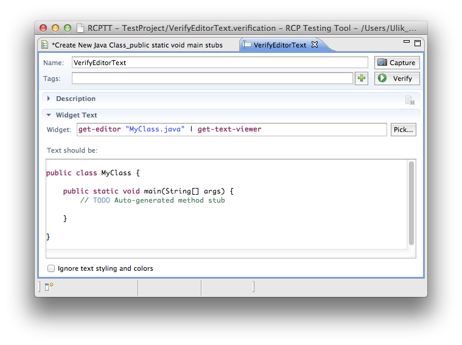
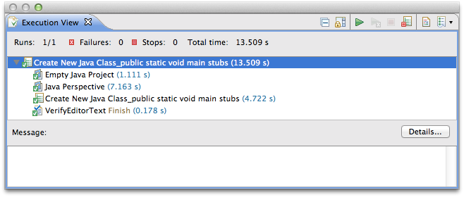


  
  <!-- Name -->
   Verification name. This name is automatically synced with file system name. Symbols in name which are not allowed in file names are replaced with 
  underscore character.

  <!-- Tags -->
   Comma-separated list of arbitrary hierarchical tags, i.e. <code>resourcePerspective, jira/PC-1352, windows-only</code>
  
  <!-- Capture button  -->
  Make a snapshot of a text from AUT widget defined in Widget field and copy it into this verification. 
  

  <!-- Verify button  -->
   Verifies whether a text in a text Widget equals the text from a verification. If Ignore text styling and colors option is off, verifies text style as well. 

  <!-- Widget -->
   AUT text widget from which a text is taken for verification. You can set the value manually or using Pick... button.
  
  
  <!-- Pick button -->
   Use this button to select AUT text widget for verification.
  
  <!-- Text area -->
   Verified text. If Ignore text styling and colors option is on you can edit text value. 
  
  <!-- Ignore text styling and colors -->
   Verification will pass even if color, font or other text formatiing does not match 
 

## Example
Let's say you need to check the result of creating *public static void main* method stubs while adding a new Java Class.

So you go through the following steps:

- Create a new test case, add required [contexts](../../contexts)
- Start recording. 
  - Create new Java class and check "create public static void main stubs" option.
- Stop recording - your actions have been recorded as ECL script:
  
- In a test case editor go to **Verification** tab and press  Add button Click Capture button and select **Widget text** verification type. Set verification name and press Finish. Now, while you are in a Capture mode, select Java Class editor. Your verification will be added into a test:
  
- If you open verification you can see that it contains the styled text to verify and the widget to take the text from. Verification checks both:
  - text content
  - and text styles.

  If you want to verify a plain text only, then select Ignore text styling and colors option.
  
  
- Now, when you run your test case, it's verification result will be shown in a Execution View:
  

