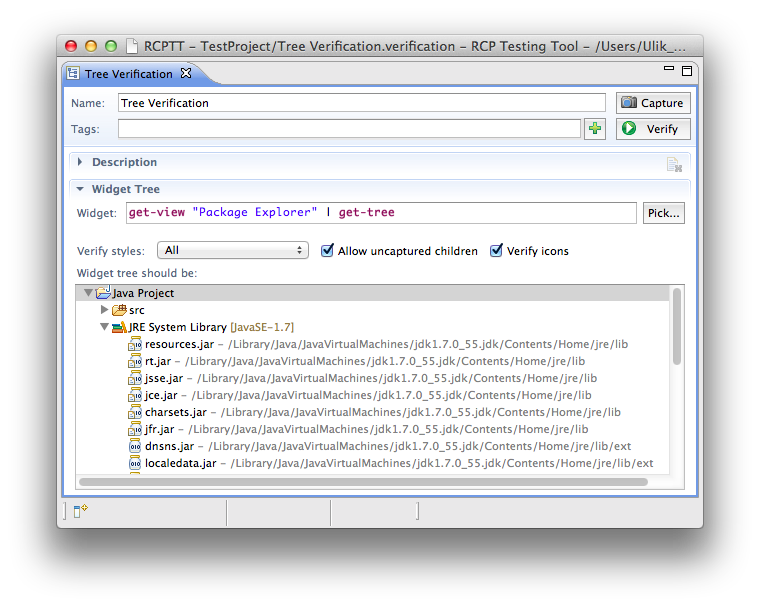
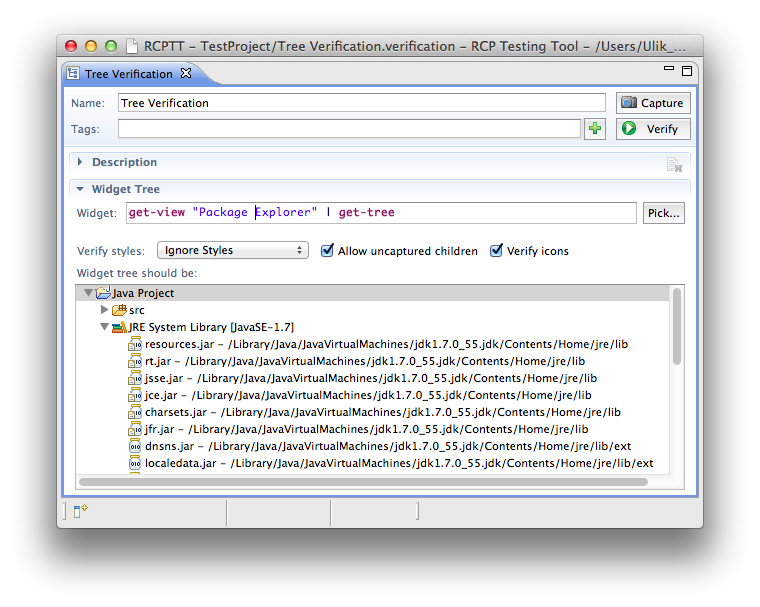
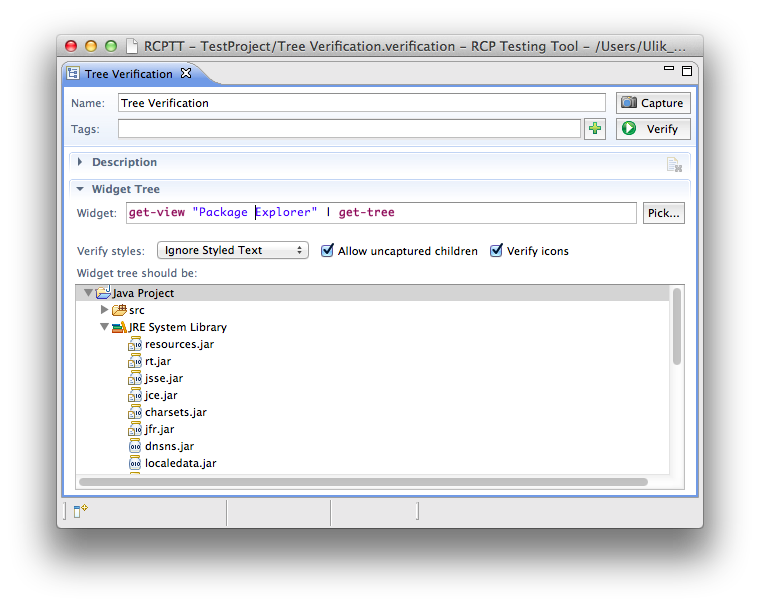


  
  <!-- Name -->
   Verification name. This name is automatically synced with file system name. Symbols in name which are not allowed in file names are replaced with 
  underscore character.

  <!-- Tags -->
   Comma-separated list of arbitrary hierarchical tags, i.e. <code>resourcePerspective, jira/PC-1352, windows-only</code>
  
  <!-- Capture button  -->
   Make a snapshot of AUT widget defined in Widget field and copy it into verification.  

  <!-- Verify button  -->
   Verifies whether AUT tree/table defined in Widget matches the tree/table from a verification.
  
  
  <!-- Widget -->
   AUT tree/table widget for verification. You can set the value manually or using Pick... button.
 
  
  <!-- Verify styles option  -->
   Styles option for verification. Can be All/Ignore Styles/Ignore Styled Text. 
  
  <!-- Allow children -->
  Turned on by default. If this option is off - verification fails if there are uncaptured children in AUT tree. 
  
  <!-- Verify icons -->
  Turned on by default. If this option is off - verification ignores icons. 
  
  <!-- Tree area -->
   Captured tree/table. 
  


Tree/Table verification is the most convenient way to assert the whole tree/table state at the end of the test case. 
It is simpler than ECL assertions, where you explicitly select a separate tree/table items to verify their properties.

## Style verification options
There are three options for style verification:
- All
- Ignore Styles
- Ignore Styled text

### All
Tree appearance is verified as is:

Verification fails if text style or content changes.

### Ignore Styles
Styled text is verified as a plain text:

Verification fails if text content changes. Any style is accepted.

### Ignore Styled Text
If there is a styled text - it will be ignored:

Verification fails if any unstyled text changed. Styled text may have any styles or content.

  
